# Munchies — Architecture Deep Dive

> Android · Kotlin Multiplatform · Jetpack Compose

---

## Agenda

1. [System Overview](#1-system-overview)
2. [Module Boundaries & KMP Strategy](#2-module-boundaries--kmp-strategy)
3. [Data Flow End-to-End](#3-data-flow-end-to-end)
4. [Resilience: Surviving Backend Problems](#4-resilience-surviving-backend-problems)
5. [API Versioning & Compatibility Strategy](#5-api-versioning--compatibility-strategy)
6. [Preventing App Crashes: Defensive Patterns](#6-preventing-app-crashes-defensive-patterns)
7. [KMP Boundary Rules](#7-kmp-boundary-rules)
8. [Testing Strategy](#8-testing-strategy)

---

## 1. System Overview

### What is Munchies?

A food delivery listing app — browse restaurants, filter by category, see open/closed status and delivery time.

### Technology Stack

| Layer | Technology |
|-------|-----------|
| UI | Jetpack Compose (Material 3) |
| State | Kotlin `StateFlow` + Coroutines |
| Architecture | Clean Architecture + MVVM |
| Networking | Ktor 3.4 |
| Serialisation | `kotlinx.serialization` |
| DI | Koin 4.2 |
| Code sharing | Kotlin Multiplatform (KMP) |

### High-Level Architecture

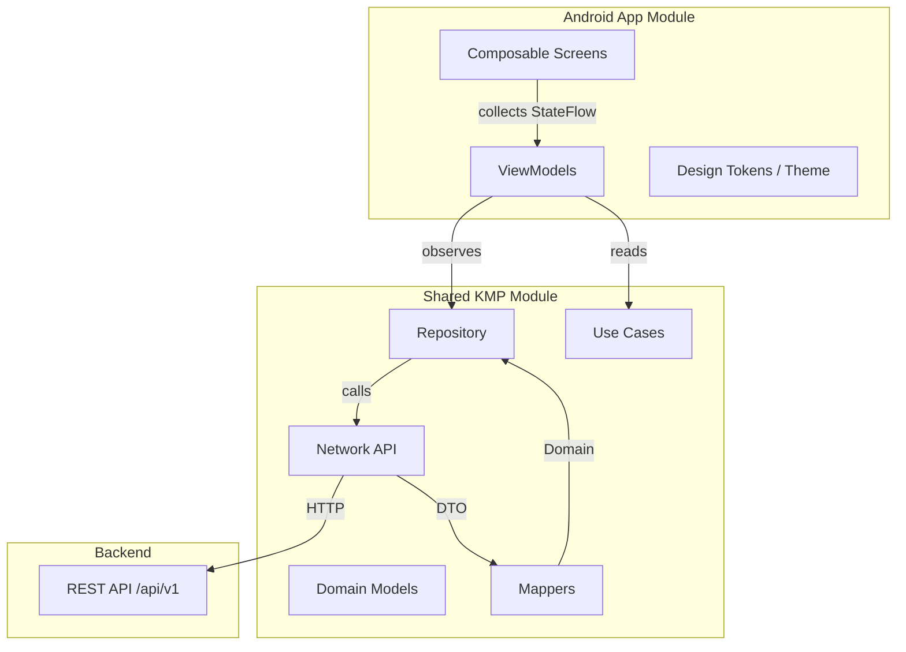

---

## 2. Module Boundaries & KMP Strategy

### Two-Module Setup

```
Munchies/
├── app/          ← Android-only (UI, ViewModels, DI wiring)
└── shared/       ← Kotlin Multiplatform (network, domain, repo, use cases)
```

### What Lives Where

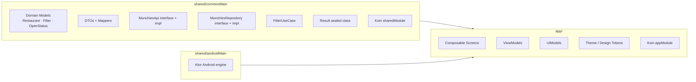

### Why This Split?

- The **shared module can be reused on iOS** without changing a single line of business logic
- The **app module stays thin** — it only knows how to render and react
- Tests run on the JVM, not a device or emulator

---

## 3. Data Flow End-to-End

### Full Request Lifecycle

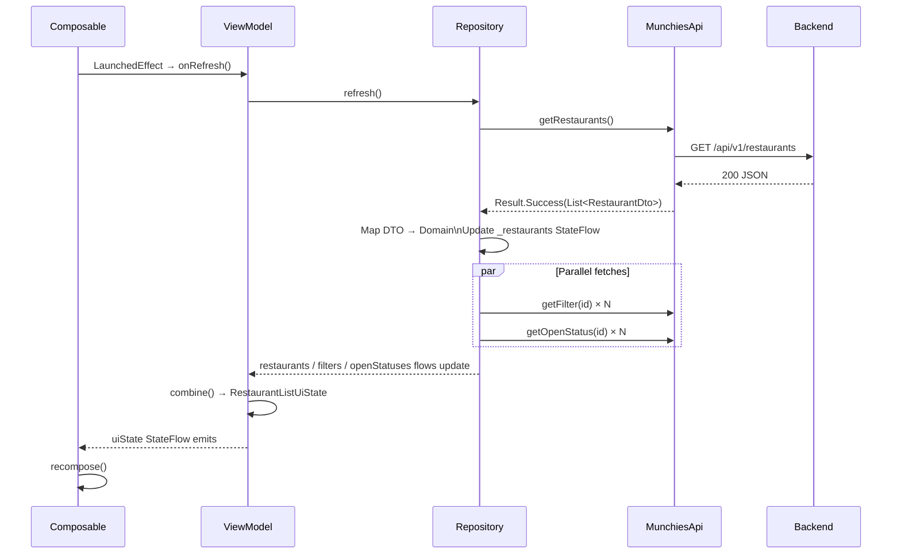

### State Machine per Screen

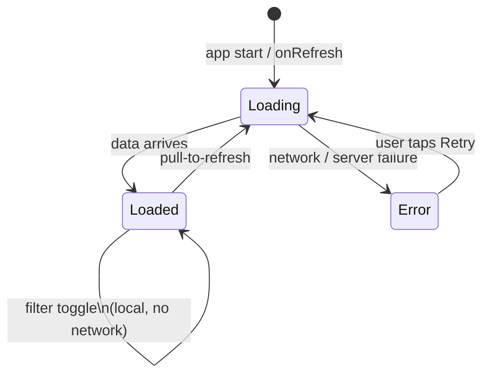

### Layer Model

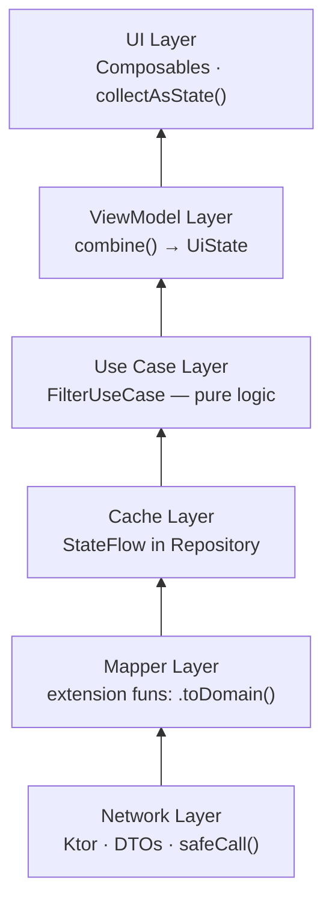

---

## 4. Resilience: Surviving Backend Problems

### The Problem

The backend can fail in many ways: timeout, 5xx, malformed JSON, slow response, partial data.

### Current: In-Memory Cache as a Safety Net

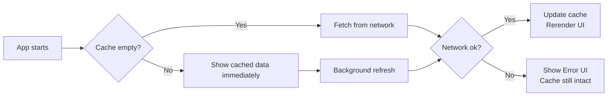

When data is already cached, users **keep seeing the last good state** even when the network fails on refresh.

### safeCall — Centralised Error Boundary

```kotlin
// shared/network/MunchiesApi.kt
private suspend fun <T> safeCall(call: suspend () -> T): Result<T> =
    try {
        Result.Success(call())
    } catch (e: Exception) {
        Result.Error(e.message ?: "Unknown error", cause = e)
    }
```

Every network call is wrapped here. **No uncaught exception can propagate up the stack.**

### Result Type as a Contract

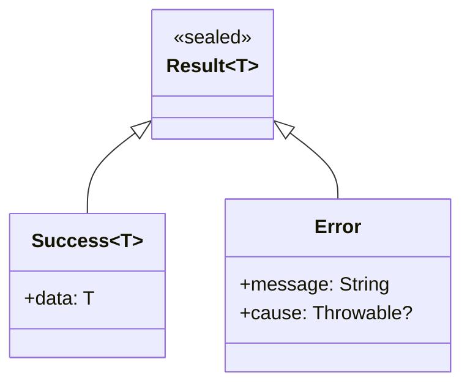

The repository **always** receives a `Result`, never a raw exception.

### Next Step: Disk Persistence

Adding Room or DataStore would make the app **survive process death** — the next session loads from disk instead of showing a blank screen.

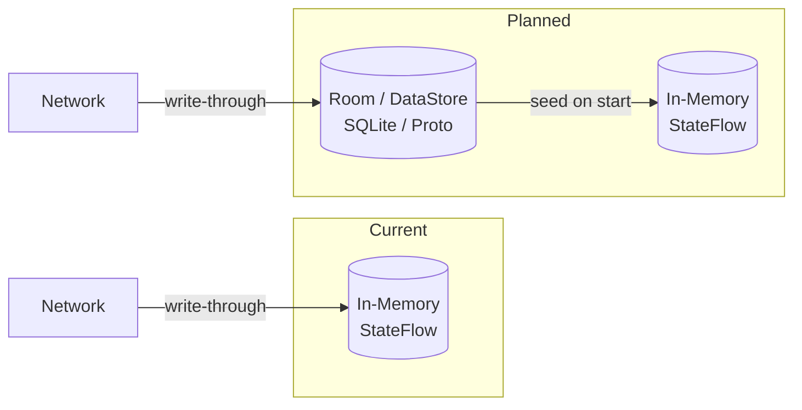

---

## 5. API Versioning & Compatibility Strategy

### The Versioning Challenge

A shipped app can be months old before a user updates it. The backend may change. These two must coexist.

### Current Foundation: Lenient JSON Parsing

```kotlin
// shared/network/HttpClientFactory.kt
Json {
    ignoreUnknownKeys = true   // New fields from the API are silently ignored
    isLenient = true           // Minor formatting differences don't crash parsing
}
```

This is the **first line of defence** — the app doesn't crash when the API adds new fields.

### Recommended: Version Header Negotiation

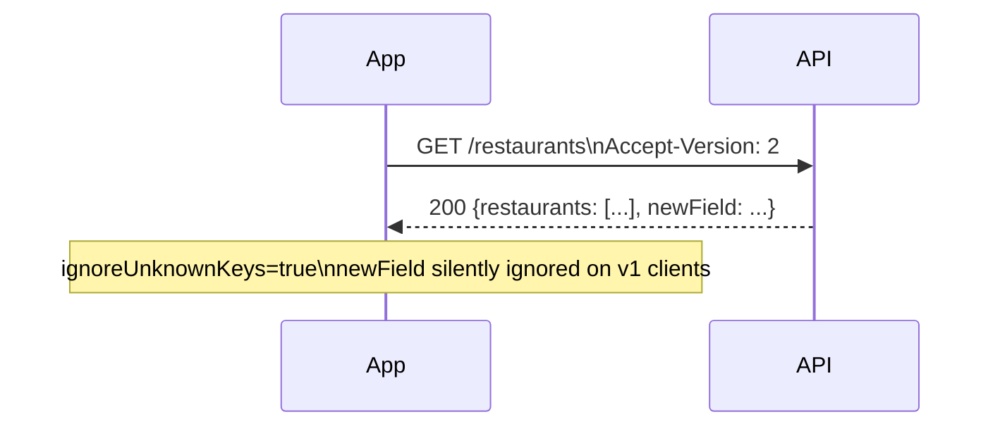

Add `Accept-Version` header in `HttpClientFactory`:

```kotlin
install(DefaultRequest) {
    header("Accept-Version", BuildConfig.API_VERSION)  // "2"
}
```

### Recommended: API Version in Base URL

```
https://food-delivery.umain.io/api/v1/restaurants   ← current
https://food-delivery.umain.io/api/v2/restaurants   ← new version
```

Bump `BASE_URL` in a constant; old clients keep using `v1` until they update.

### Recommended: Graceful Deprecation with DTO Defaults

If the API **removes** a field, give the DTO a safe default so old domain logic still works:

```kotlin
@Serializable
data class RestaurantDto(
    val id: String,
    val name: String,
    val rating: Double = 0.0,                // safe default if removed
    val delivery_time_minutes: Int = -1,     // sentinel: unknown
    val filterIds: List<String> = emptyList(),
    val image_url: String = ""
)
```

### Version Compatibility Matrix

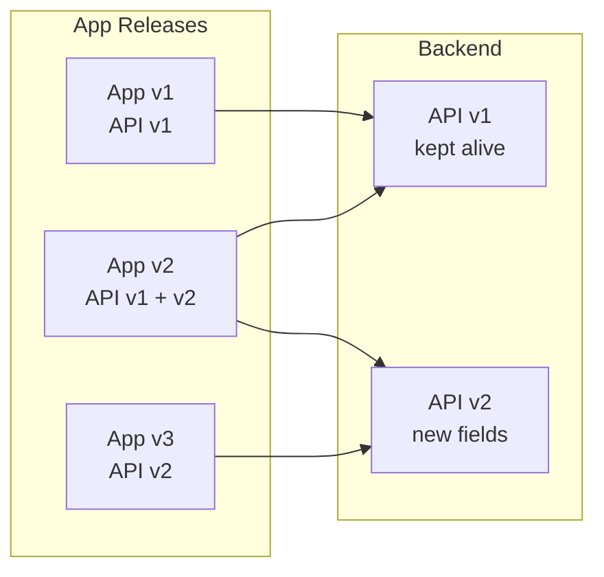

Always keep `v1` alive until the active install base drops below an acceptable threshold.

---

## 6. Preventing App Crashes: Defensive Patterns

### Pattern 1 — Sealed Result, Never Throw

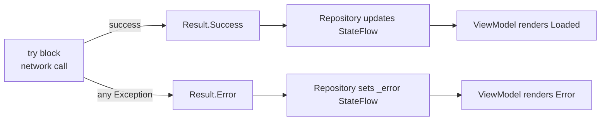

**No `throw` in business logic.** Errors are values, not exceptions.

### Pattern 2 — Mutex-Protected Refresh

```kotlin
private val refreshMutex = Mutex()

override suspend fun refresh() {
    if (refreshMutex.isLocked) return   // already in progress, skip
    refreshMutex.withLock {
        // fetch …
    }
}
```

Prevents **race conditions** if the user rapidly triggers refresh.

### Pattern 3 — Deduplication of Parallel Requests

```kotlin
val filterIds = restaurantList.flatMap { it.filterIds }.toSet()  // unique IDs only
val deferred = filterIds.map { id -> async { api.getFilter(id) } }
```

Avoids N duplicate API calls when multiple restaurants share the same filter.

### Pattern 4 — Null-Safe Open Status

```kotlin
data class RestaurantUiModel(
    val isOpen: Boolean?   // null = status not yet fetched, not "closed"
)
```

The badge is hidden if `isOpen == null` rather than showing the wrong state.

### Pattern 5 — ViewModel Survives Config Changes

```kotlin
val uiState: StateFlow<RestaurantListUiState> =
    combine(
        repository.restaurants,
        repository.filters,
        repository.openStatuses,
        repository.isLoading,
        repository.error,
        filterUseCase.activeFilterIds,
    ) { … }
    .stateIn(
        scope = viewModelScope,
        started = SharingStarted.WhileSubscribed(5_000),   // survive brief lifecycle pauses
        initialValue = RestaurantListUiState(isLoading = true)
    )
```

`WhileSubscribed(5_000)` keeps the upstream alive for 5 seconds during a screen rotation so no refetch occurs.

### Pattern 6 — Coroutine Error Boundary in Repository

```kotlin
// Repository init:
private val scope = CoroutineScope(SupervisorJob() + Dispatchers.Default)
```

`SupervisorJob` means a failed child coroutine (e.g. one `getFilter` call) does **not** cancel the entire refresh — other requests continue.

---

## 7. KMP Boundary Rules

### The Golden Rule

> **The shared module must not contain anything Android-specific.**

This keeps the iOS path open and the module testable on pure JVM.

### What Is Allowed in Shared

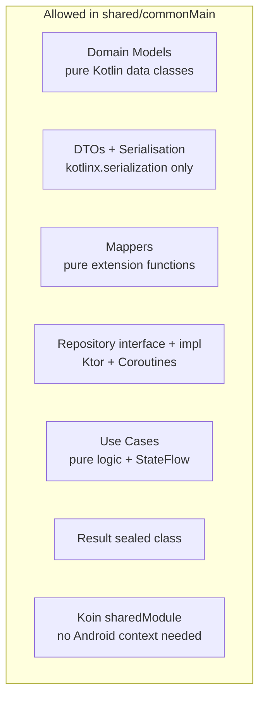

### What Must Stay in app/

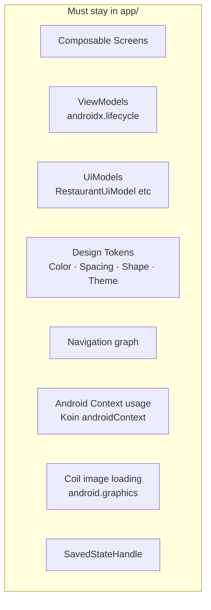

### Checklist: Reviewing a Shared Module PR

| Check | Pass Condition |
|-------|---------------|
| No `import android.*` | Zero Android SDK imports |
| No `Context` parameter | Use constructor injection via Koin |
| No `ViewModel` base class | Use plain classes + `StateFlow` |
| No Compose imports | UI stays in `:app` |
| No `R.string / R.drawable` | No resource references |
| Tests run without emulator | `./gradlew :shared:test` passes |

---

## 8. Testing Strategy

### Test Pyramid

```mermaid
graph TD
    subgraph Unit Tests  shared/commonTest  fast · JVM
        T1[MunchiesApiTest\nhappy path · HTTP errors · malformed JSON]
        T2[MapperTests\nDTO → Domain conversion]
        T3[FilterUseCaseTest\ntoggle · clear · OR filter logic]
        T4[RepositoryTest\nparallel fetch · deduplication · error handling]
    end
    subgraph Integration Tests  planned
        T5[Room migration tests]
        T6[End-to-end with MockWebServer]
    end
    subgraph UI Tests  planned
        T7[Compose screenshot tests]
        T8[Navigation flow tests]
    end
```

### No Emulator Needed for Business Logic

```
./gradlew :shared:test
```

All network, mapping, use-case, and repository tests run on the **JVM in under a second**. This is a direct benefit of the KMP boundary.

### Example: Testing Error Handling

```kotlin
@Test
fun `getRestaurants returns error on 500`() = runTest {
    val engine = MockEngine { _ ->
        respondError(HttpStatusCode.InternalServerError)
    }
    val api = MunchiesApiImpl(buildClient(engine))
    val result = api.getRestaurants()

    assertIs<Result.Error>(result)
}
```

---

## Key Takeaways

| Topic | Decision | Benefit |
|-------|----------|---------|
| KMP boundary | All business logic in `shared` | iOS-ready; JVM-testable |
| Error handling | Sealed `Result` type | No unexpected crashes from network layer |
| Caching | In-memory `StateFlow` | Users see data even during refresh failures |
| JSON parsing | `ignoreUnknownKeys = true` | Tolerant of API additions |
| DTO defaults | Safe default values | Tolerant of API removals |
| Concurrency | `Mutex` + `SupervisorJob` | No race conditions, partial failures don't cancel everything |
| State exposure | `stateIn(WhileSubscribed(5000))` | Rotation-safe, no unnecessary refetch |
| Navigation | ID-based detail routing | No serialization of large objects between screens |

---

*Built with Kotlin 2.3 · Compose 2026.03 · Ktor 3.4 · Koin 4.2*
