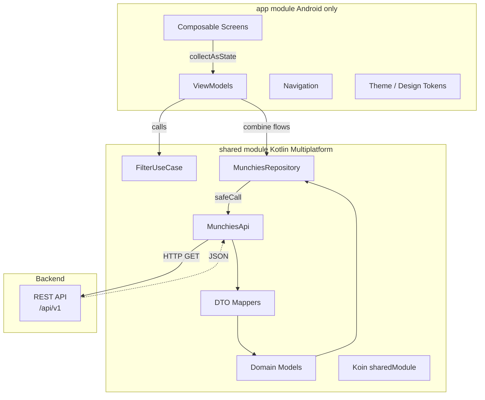
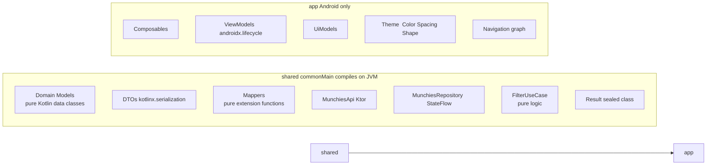
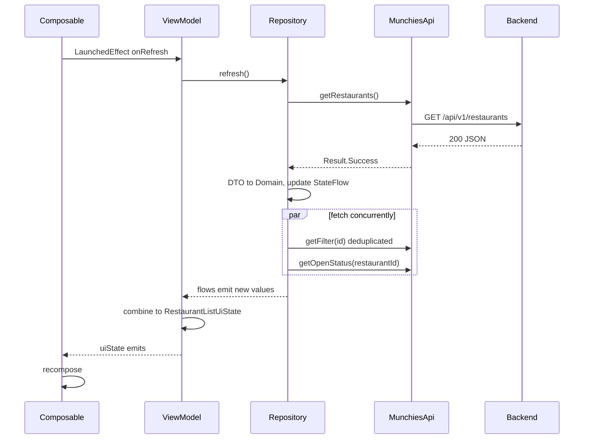
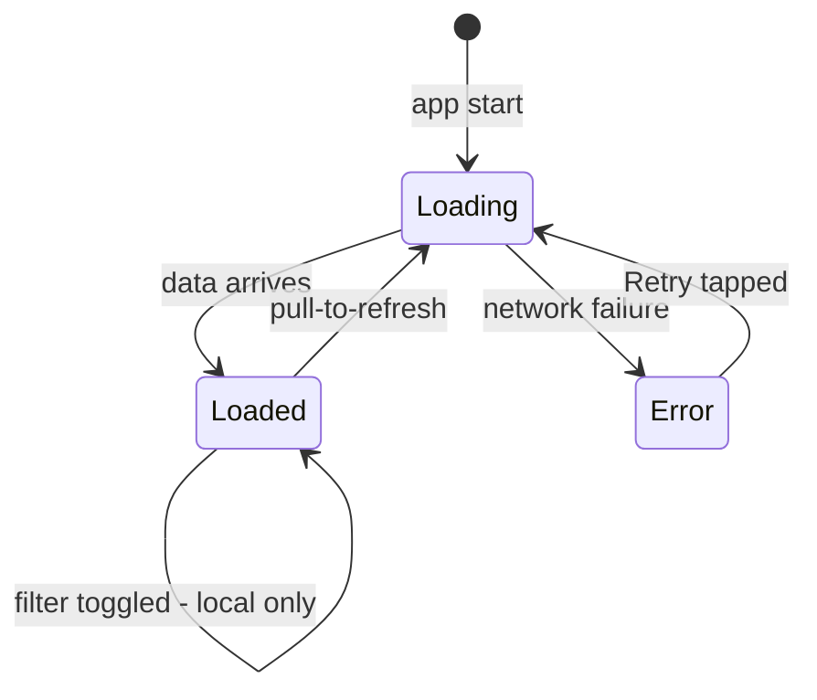
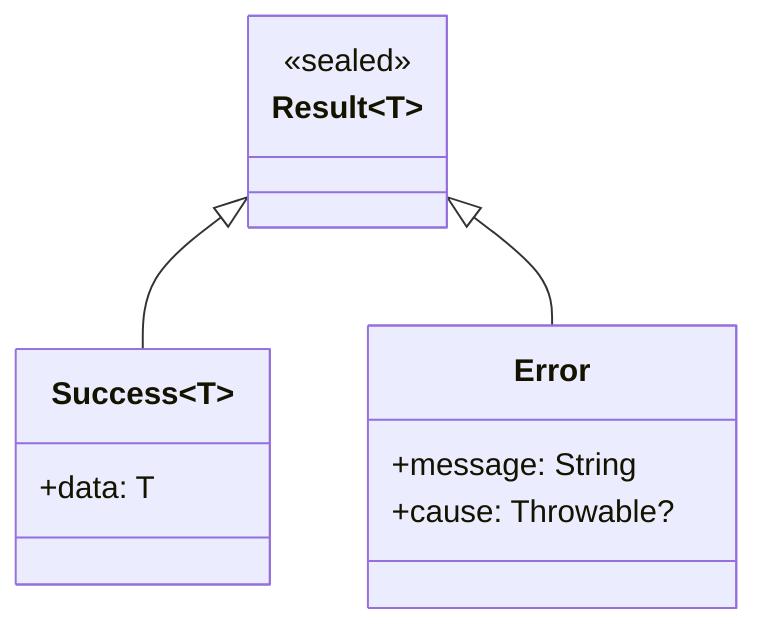
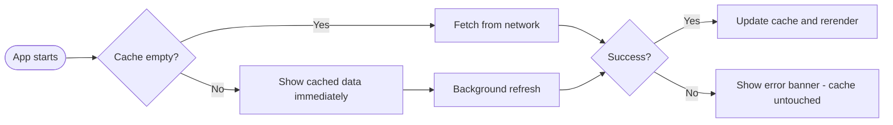
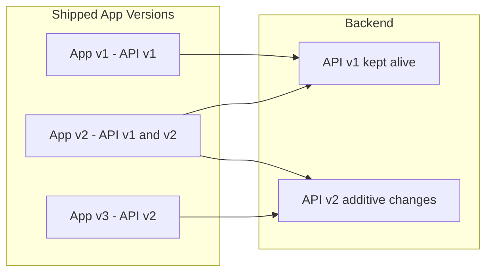
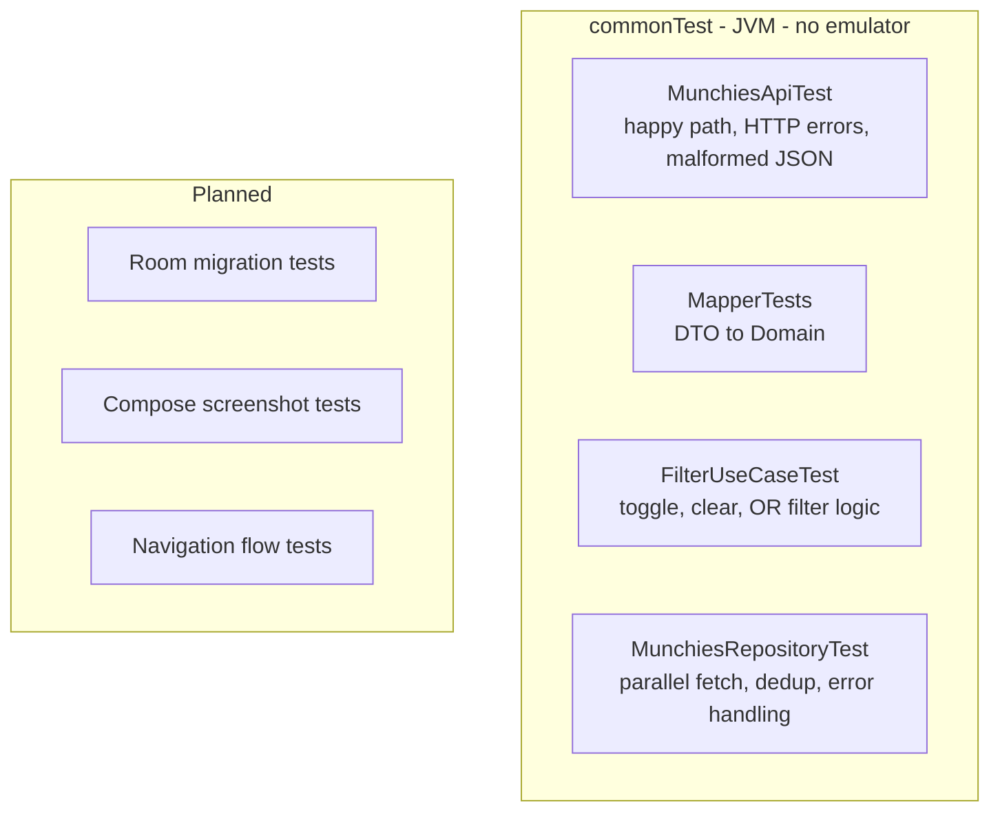

# Munchies — Architecture Presentation

> Android · Kotlin Multiplatform · Jetpack Compose

---

## 1. Project Context

A food-delivery listing app. Browse restaurants, filter by category, check open/closed status and delivery time.

**Why this stack?**

| Goal | Choice | Reason |
|------|--------|--------|
| Share logic with iOS | KMP (`shared` module) | Same network + domain + cache on both platforms |
| Reactive UI | `StateFlow` + Compose | No manual UI updates, config-change safe |
| Lightweight DI | Koin | No annotation processing — works in KMP `commonMain` |
| HTTP | Ktor | Pure Kotlin, runs in `commonMain` — Retrofit needs OkHttp (Android-only) |

---

## 2. Architecture Overview



### Module boundary — enforced by the build graph



> If `import android.*` appears in `shared`, the JVM target fails to compile. The boundary is not a convention — it is enforced.

---

## 3. Data Flow



### Screen state machine



---

## 4. Resilience — Surviving Backend Failures

### Error as a value



One `safeCall` wrapper in `MunchiesApiImpl` catches every network exception. Nothing above it ever handles a throw.

### Cache as a safety net



The list stays visible when a refresh fails. The error banner appears on top of existing data.

### Concurrency safeguards

| Mechanism | File + line | What it prevents |
|-----------|-------------|-----------------|
| `Mutex` | `MunchiesRepositoryImpl:41` | Overlapping refreshes |
| `SupervisorJob` | `MunchiesRepositoryImpl:23` | One failed child cancelling the whole refresh |
| `toSet()` dedup | `MunchiesRepositoryImpl:62` | Duplicate filter API calls |
| `Boolean?` status | `RestaurantListViewModel:57` | Badge showing Closed before status loads |

---

## 5. API Versioning & Forward Compatibility

### Lenient JSON parsing — already in place

```kotlin
// HttpClientFactory.kt
Json {
    ignoreUnknownKeys = true   // new API fields silently ignored
    isLenient = true           // minor formatting differences accepted
}
```

### DTO defaults — recommendation

```kotlin
@Serializable
data class RestaurantDto(
    val id: String,
    val name: String,
    val rating: Double = 0.0,
    val delivery_time_minutes: Int = -1,
    val filterIds: List<String> = emptyList(),
    val image_url: String = ""
)
```

Old clients survive field removals without crashing.

### Versioned base URL — recommendation

```
/api/v1/restaurants  current clients
/api/v2/restaurants  new clients
```

### Client–server compatibility



Keep `v1` alive until the active install base drops below an acceptable threshold.

---

## 6. KMP Boundary Rules

### What is allowed in `shared/commonMain`

- Pure Kotlin data classes (domain models)
- `kotlinx.serialization` DTOs
- Pure extension-function mappers
- Ktor HTTP layer
- `StateFlow`-based repository
- Use cases (pure logic)
- Koin wiring — no Android context needed

### What must stay in `app/`

- Composable screens
- `androidx.lifecycle.ViewModel`
- UiModels (screen-specific domain transformations)
- Design tokens — Color, Spacing, Shape, Typography
- Navigation graph
- Coil image loading
- `SavedStateHandle`
- Any `android.*` import

### PR checklist for shared module changes

| Check | Pass condition |
|-------|---------------|
| No `import android.*` | Zero Android SDK imports |
| No `Context` parameter | Koin constructor injection only |
| No `ViewModel` base class | Plain class + `StateFlow` |
| No Compose imports | UI stays in `:app` |
| No `R.string` or `R.drawable` | No resource references |
| Tests pass without emulator | `./gradlew :shared:test` green |

---

## 7. Testing

All business-logic tests run on the JVM — no emulator required.

```
./gradlew :shared:test
```



---

## 8. Trade-offs & What Is Next

| Topic | Current | Next step |
|-------|---------|-----------|
| Persistence | In-memory `StateFlow` — lost on process death | SQLDelight (KMP) or Room + write-through |
| API versioning | `ignoreUnknownKeys` only | Versioned URL + DTO defaults |
| Modularisation | Two modules `:app` and `:shared` | Feature modules `:feature:list`, `:feature:detail` |
| Pagination | Full list from one endpoint | Cursor-based pagination |
| iOS | `commonMain` ready, no iOS targets yet | Add `iosArm64` + Darwin Ktor engine |

---

*Kotlin 2.3 · Compose 2026.03 · Ktor 3.4 · Koin 4.2 · Coroutines 1.10*